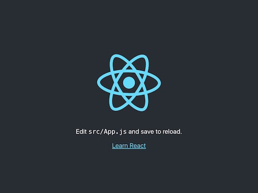

# warsawjs-workshop-32-book-it
WarsawJS Workshop #32 project - Book your favourite hotels and resorts from the comfort of your home
## Uruchomienie projektu

Komenda `npm start` uruchamia serwer z projektem w trybie deweloperskim.
Otwórz [http://localhost:3000](http://localhost:3000) w przeglądarce, by zobaczyć projekt.
Strona powinna przeładowywać się automatycznie po każdym zapisie pliku.

Po poprawnym uruchomieniu zobaczysz podobny ekran:

